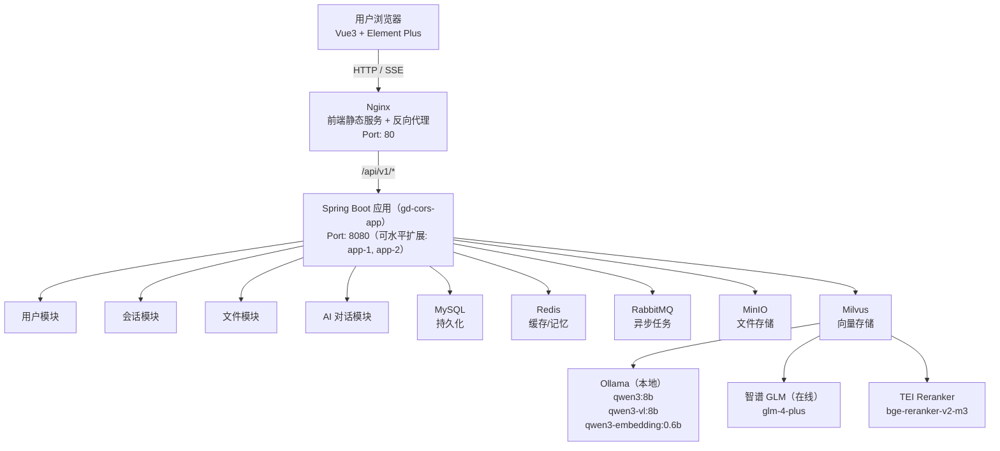

# gd-cors 项目技术文档

## 目录

1. [项目概述](#1-项目概述)
2. [整体架构](#2-整体架构)
3. [技术栈](#3-技术栈)
4. [后端模块详解](#4-后端模块详解)
5. [前端模块详解](#5-前端模块详解)
6. [数据库设计](#6-数据库设计)
7. [消息队列设计](#7-消息队列设计)
8. [AI / RAG 能力](#8-ai--rag-能力)
9. [文件存储与向量化流程](#9-文件存储与向量化流程)
10. [认证与安全](#10-认证与安全)
11. [部署架构](#11-部署架构)
12. [配置说明](#12-配置说明)
13. [API 接口总览](#13-api-接口总览)

---

## 1. 项目概述

**gd-cors** 是一个面向企业/团队的 AI 知识库问答平台，核心能力包括：

- **RAG（检索增强生成）**：用户上传文档后，系统自动解析、向量化并存入 Milvus，AI 对话时可检索相关知识片段作为上下文。
- **多模型支持**：同时支持本地 Ollama 模型（Qwen 系列）和在线云端模型（智谱 GLM 系列），用户可在对话时自由切换。
- **文件管理**：提供完整的文件系统（上传、下载、重命名、移动、删除、文件夹管理），文件存储于 MinIO 对象存储，支持**文件版本管理**（多版本追加、历史版本查看、任意版本回滚）。
- **流式对话**：基于 SSE（Server-Sent Events）实现实时流式输出，支持断点续传和手动停止。
- **多会话管理**：每个用户可创建多个独立会话，会话历史持久化存储，对话记忆基于 Redis 实现。

---

## 2. 整体架构



---

## 3. 技术栈

### 后端

| 类别 | 技术 | 版本 |
|------|------|------|
| 基础框架 | Spring Boot | 3.5.3 |
| 语言 | Java | 17 |
| ORM | MyBatis Plus | 3.5.5 |
| 数据库 | MySQL | 8.0.36 |
| 缓存 | Redis | 8.0.3 |
| 分布式锁 | Redisson | 3.52.0 |
| 消息队列 | RabbitMQ | 3.8 |
| 对象存储 | MinIO | 8.6.0 |
| 向量数据库 | Milvus | 2.6.6 |
| AI 框架 | LangChain4j | 1.11.0 / 1.11.0-beta19 |
| 本地模型 | Ollama | - |
| 文档解析 | Apache Tika | - |
| 认证 | JWT (java-jwt 4.4.0) | - |
| 工具库 | Hutool | 5.8.28 |
| HTTP 客户端 | OkHttp | 4.12.0 |
| 流式响应 | Project Reactor (WebFlux) | - |

### 前端

| 类别 | 技术 | 版本 |
|------|------|------|
| 框架 | Vue 3 | ^3.4.15 |
| 构建工具 | Vite (rolldown-vite) | latest |
| UI 组件库 | Element Plus | 2.11.3 |
| UI 组件库 | Naive UI | ^2.41.0 |
| 状态管理 | Pinia | ^3.0.1 |
| 路由 | Vue Router | ^4.2.5 |
| HTTP 客户端 | Axios | ^1.13.0 |
| SSE 客户端 | @microsoft/fetch-event-source | ^2.0.1 |
| Markdown 渲染 | marked + highlight.js | - |
| 文件 MD5 | spark-md5 | ^3.0.2 |
| 错误监控 | Sentry | ^10.30.0 |
| 语言 | TypeScript | ~5.7.3 |

---

## 4. 后端模块详解

### 4.1 包结构

```
com.cors/
├── Application.java              # 启动类
├── advice/                       # 全局异常处理
│   └── GlobalExceptionHandler.java
├── annotation/                   # 自定义注解
│   └── AuthorizeAnnotation.java  # 管理员权限注解
├── aspect/                       # AOP 切面
│   ├── AuthorizeAspect.java      # 权限校验切面
│   └── MilvusSearchTimingAspect.java  # Milvus 搜索耗时统计
├── cache/
│   └── MybatisRedisCache.java    # MyBatis 二级缓存（Redis 实现）
├── config/                       # 配置类
│   ├── MinIoConfig.java
│   ├── MybatisPlusConfig.java
│   ├── RedisConfig.java
│   ├── RedissonConfig.java
│   ├── SecurityConfig.java
│   ├── SpringMvcConfig.java      # 拦截器注册、CORS 配置
│   ├── ThreadPoolConfig.java
│   ├── llm/                      # AI 模型配置
│   │   ├── AssistantConfig.java  # AI 助手 Bean 装配
│   │   ├── ChatMemoryConfig.java # 对话记忆配置
│   │   ├── LlmConfig.java
│   │   ├── OnlineChatModelConfig.java
│   │   ├── QwenChatModelConfig.java
│   │   ├── QwenEmbeddingModelConfig.java
│   │   ├── QwenVlModelConfig.java
│   │   ├── RerankerModelConfig.java
│   │   └── WebSearchConfig.java
│   ├── mcp/
│   │   └── McpToolProviderConfig.java  # MCP 工具提供者
│   ├── milvus/                   # 向量数据库配置
│   │   ├── ContentRetrieverConfig.java
│   │   ├── EmbeddingStoreConfig.java
│   │   └── MilvusClientConfig.java
│   └── rabbitmq/
│       ├── RabbitConfig.java
│       └── RabbitInitConfig.java # 队列/交换机声明
├── constant/
│   └── CommonConstants.java
├── context/
│   └── ChatStreamContext.java    # 流式对话上下文（Sink + Disposable）
├── controller/                   # REST 控制器
│   ├── ChatController.java
│   ├── FileController.java
│   ├── MessageController.java
│   ├── SessionController.java
│   └── UserController.java
├── domain/                       # 领域模型
│   ├── dto/                      # 请求 DTO
│   │   └── SwitchVersionDto.java # 切换版本请求 DTO
│   ├── entity/                   # 数据库实体
│   │   └── FileVersion.java      # 文件版本实体
│   ├── vo/                       # 响应 VO
│   │   └── FileVersionVo.java    # 文件版本响应 VO
│   ├── ResponseResult.java       # 统一响应体
│   ├── ResultCode.java
│   ├── FileCheckResult.java
│   └── StorageUsage.java
├── enums/                        # 枚举
│   ├── AssistantType.java        # LOCAL / ONLINE
│   ├── FileVectorStatusType.java # PENDING/PROCESSING/SUCCESS/FAILED/UNSUPPORTED
│   ├── MessageType.java          # TEXT/IMAGE/AUDIO/FILE/JSON
│   ├── RoleType.java             # USER/ADMIN
│   └── SenderType.java           # USER/AI/SYSTEM
├── exception/                    # 自定义异常
├── handler/
│   └── MetaObjectHandler.java    # MyBatis Plus 自动填充
├── interceptor/
│   └── UserInterceptor.java      # JWT 解析 + 用户上下文注入
├── lock/
│   └── HierarchicalLockHelper.java  # 层级锁（文件夹操作）
├── mapper/                       # MyBatis Mapper
│   └── FileVersionMapper.java    # 文件版本 Mapper
├── memory/
│   └── RedisChatMemoryStore.java # 对话记忆 Redis 存储
├── mq/                           # 消息队列
│   ├── consumer/                 # 消费者
│   │   ├── FileStorageDeleteConsumer.java
│   │   ├── FileVectorConsumer.java
│   │   └── FileVectorDeleteConsumer.java
│   ├── message/                  # 消息体
│   │   ├── FileDeleteMessage.java
│   │   └── FileVectorMessage.java
│   └── producer/                 # 生产者
│       ├── FileStorageDeleteProducer.java
│       ├── FileVectorDeleteProducer.java
│       └── FileVectorProducer.java
├── service/                      # 业务服务
│   ├── FileVersionService.java   # 文件版本管理 Service 接口
│   ├── ai/
│   │   ├── Assistant.java        # AI 助手接口（LangChain4j AiService）
│   │   ├── LocalAssistant.java   # 本地模型助手
│   │   └── OnlineAssistant.java  # 在线模型助手
│   └── Impl/
│       └── FileVersionServiceImpl.java  # 文件版本管理 Service 实现
├── tool/                         # LangChain4j Tool（Function Calling）
│   ├── FileMetadataSearchTool.java  # 文件元数据搜索工具
│   └── WebSearchTool.java           # Tavily 联网搜索工具
├── util/                         # 工具类
│   ├── BCryptUtil.java
│   ├── JwtUtil.java
│   ├── LocalFolderIngestionService.java  # 本地文件夹批量导入
│   ├── MinIoUtil.java
│   ├── OneTimeFolderIngestionRunner.java # 启动时一次性导入
│   ├── StorageKeyGenerator.java
│   ├── TokenRedisUtil.java
│   └── UserContextUtil.java      # ThreadLocal 用户上下文
└── vector/                       # 向量化核心
    ├── ApacheTikaDocumentParser.java  # 文档解析（支持多格式）
    ├── DocumentVector.java            # 向量化入库/删除
    ├── ParallelStreamingContentHandler.java  # 并行流式内容处理
    └── TeiCustomScoringModel.java     # TEI Reranker 评分模型
```

### 4.2 核心业务流程

#### 对话流程（SSE 流式）

```
前端 POST /api/v1/sessions/messages
    │
    ▼
ChatController.submitChat()
    │  异步启动，立即返回 200
    ▼
ChatServiceImpl.startChatStream()
    ├── 校验会话归属
    ├── 获取 Semaphore 锁（防止同一会话并发）
    ├── 保存用户消息到 DB
    ├── 创建 Sinks.Many（replay().all()，支持断点续传）
    └── 订阅 AI Flux 流
            │
            ▼
    Assistant.chat(memoryId, message)
    ├── LangChain4j RAG 检索（Milvus 向量搜索 + Reranker 重排）
    ├── Function Calling（FileMetadataSearchTool）
    └── 流式生成 token

前端 GET /api/v1/sessions/{id}/sse
    │
    ▼
ChatController.streamCompletion()
    └── ChatServiceImpl.subscribe()
            ├── 从 contextMap 获取 Sink
            ├── 支持 Last-Chunk-ID 断点续传
            └── 返回 Flux<ServerSentEvent<String>>

AI 生成完毕
    └── saveOnce.run()
            ├── 保存 AI 消息到 DB
            ├── sink.tryEmitComplete()
            └── 释放 Semaphore 锁
```

#### 文件上传与向量化流程

```
前端 POST /api/v1/files/upload (multipart/form-data)
    │
    ▼
FileController.uploadFile()
    │
    ▼
FileMetadataServiceImpl.uploadFile()
    ├── 上传文件到 MinIO（storageKey = UUID + 扩展名）
    ├── 保存文件元数据到 MySQL（currentVersion=1, versionCount=1）
    ├── 写入 file_versions 版本记录（v1）
    └── 发送 FileVectorMessage 到 RabbitMQ

RabbitMQ file-vector-queue
    │
    ▼
FileVectorConsumer.processFileVector()
    ├── 幂等性检查（PENDING → PROCESSING）
    └── DocumentVector.processUploadDoc()
            ├── 从 MinIO 下载文件流
            ├── ApacheTikaDocumentParser 解析（支持 PDF/Word/Excel/PPT 等）
            ├── 文本切分（Splitter）
            ├── Embedding 模型向量化（qwen3-embedding:0.6b）
            └── 存入 Milvus（带 storage_key + batch_id 元数据）

失败时：
    ├── 更新状态为 FAILED
    ├── 发送到 file-vector-retry-queue（TTL 15s 后重新投递）
    └── 最多重试 MAX_RETRIES 次
```

---

## 5. 前端模块详解

### 5.1 目录结构

```
web-gd-cors/src/
├── assets/              # 静态资源
├── components/          # 公共组件
│   ├── ChatMessage.vue  # 消息气泡（支持 Markdown 渲染）
│   └── SystemDashboard.vue  # 系统状态面板
├── hooks/
│   └── useTools.ts      # 工具函数 Hook
├── interface/           # TypeScript 类型定义
│   ├── Tchat.ts         # 对话相关类型
│   ├── TfileSystem.ts   # 文件系统类型
│   ├── Tgeneral.ts      # 通用类型（ResType 等）
│   ├── Thome.ts
│   ├── Tlogin.ts
│   ├── Tregister.ts
│   ├── Troot.ts
│   └── Tvector.ts       # 向量状态类型
├── router/
│   └── index.js         # 路由配置 + 路由守卫
├── services/            # API 服务层
│   ├── client.ts        # Axios 实例（含 Token 自动刷新）
│   ├── file.ts          # 文件相关 API
│   ├── sessions.js      # 会话相关 API
│   └── user.ts          # 用户相关 API
├── stores/
│   └── user.ts          # Pinia 用户状态（Token 持久化）
├── utils/
│   ├── UtilMessageCache.ts    # 消息内存缓存
│   ├── UtilMessageCacheDB.ts  # 消息 IndexedDB 缓存
│   └── UtilShowSkeleton.ts    # 骨架屏工具
└── views/               # 页面视图
    ├── AIChat/          # AI 对话页（核心页面）
    ├── ChatRecord/      # 历史对话记录
    ├── FileSystem/      # 文件管理系统
    ├── Home/            # 首页
    ├── Login/           # 登录页
    ├── NotFound/        # 404 页
    ├── Register/        # 注册页
    ├── Root/            # 根布局
    ├── Upload/          # 文件上传页
    ├── User/            # 用户信息页
    └── VectorStatus/    # 向量化状态监控页
```

### 5.2 路由设计

| 路径 | 页面 | 需要登录 |
|------|------|---------|
| `/` | 重定向到 `/login` | - |
| `/login` | 登录页 | 否 |
| `/register` | 注册页 | 否 |
| `/home` | 首页 | 是 |
| `/ai-chat` | AI 对话 | 是 |
| `/root` | 根布局 | 是 |
| `/file` | 文件管理 | 是 |
| `/upload` | 文件上传 | 是 |
| `/vector-status` | 向量化状态 | 是 |
| `/:pathMatch(.*)` | 404 | - |

### 5.3 HTTP 客户端设计

`client.ts` 封装了两个 Axios 实例：

- **mainAxiosInstance**：主实例，用于所有业务 API，自动携带 `Authorization` Header，响应拦截器处理 Token 过期（业务码 401）并自动刷新。
- **refreshAxiosInstance**：刷新专用实例，携带 Cookie（Refresh Token），不经过响应拦截器，避免循环调用。

**Token 刷新机制**：
1. 检测到业务码 401 时，标记 `isRefreshing = true`
2. 后续并发请求加入 `refreshSubscribers` 队列等待
3. 刷新成功后，通知所有等待请求重试
4. 刷新失败则清除 Token 并跳转登录页

---

## 6. 数据库设计

数据库名：`gd_cors`，字符集：`utf8mb4_unicode_ci`

### 6.1 用户表 `users`

| 字段 | 类型 | 说明 |
|------|------|------|
| id | BIGINT UNSIGNED PK | 用户 ID |
| name | VARCHAR(50) | 用户名 |
| email | VARCHAR(100) UNIQUE | 邮箱（登录账号） |
| password | VARCHAR(60) | BCrypt 加密密码 |
| role | VARCHAR(10) | 角色：USER / ADMIN |
| created | DATETIME | 创建时间 |
| updated | DATETIME | 更新时间 |

默认管理员账号：`admin@example.com` / `123456`

### 6.2 会话表 `sessions`

| 字段 | 类型 | 说明 |
|------|------|------|
| id | BIGINT PK | 会话 ID |
| user_id | BIGINT | 所属用户 ID |
| title | VARCHAR(255) | 会话标题 |
| created | DATETIME | 创建时间 |
| updated | DATETIME | 更新时间 |

索引：`idx_session_user_id`、`idx_session_created`

### 6.3 消息表 `messages`

| 字段 | 类型 | 说明 |
|------|------|------|
| id | BIGINT PK | 消息 ID |
| session_id | BIGINT | 所属会话 ID |
| sender_type | VARCHAR(10) | 发送者：USER / AI / SYSTEM |
| message_type | VARCHAR(10) | 消息类型：TEXT / IMAGE / AUDIO / FILE / JSON |
| assistant_type | VARCHAR(10) | 助手类型：LOCAL / ONLINE |
| content | TEXT | 消息内容 |
| created | DATETIME | 创建时间 |

索引：`idx_message_session_id`、`idx_message_session_created`

### 6.4 文件元数据表 `file_metadata`

| 字段 | 类型 | 说明 |
|------|------|------|
| id | BIGINT UNSIGNED PK | 文件 ID |
| name | VARCHAR(255) | 文件名（含扩展名） |
| parent_id | BIGINT UNSIGNED | 父目录 ID（NULL = 根目录） |
| parent_name | VARCHAR(255) | 父目录名 |
| folder | TINYINT(1) | 是否为文件夹：0=文件，1=文件夹 |
| size | BIGINT UNSIGNED | 文件大小（字节） |
| storage_key | VARCHAR(255) UNIQUE | 当前激活版本的 MinIO 存储键 |
| md5 | CHAR(32) | 文件 MD5 |
| association | TINYINT(1) | 是否已有关联信息 |
| **current_version** | **INT UNSIGNED** | **当前激活版本号（从1开始），文件夹为 NULL** |
| **version_count** | **INT UNSIGNED** | **总版本数（冗余字段），文件夹为 NULL** |
| created_by | BIGINT | 创建者 ID |
| updated_by | BIGINT | 更新者 ID |
| created | DATETIME | 上传时间 |
| updated | DATETIME | 更新时间 |

索引：`idx_parent_id_id`、`idx_files_created`

### 6.5 文件版本表 `file_versions`（新增）

| 字段 | 类型 | 说明 |
|------|------|------|
| id | BIGINT UNSIGNED PK AUTO_INCREMENT | 版本记录 ID |
| file_id | BIGINT UNSIGNED | 关联的 file_metadata.id |
| version | INT UNSIGNED | 版本号（从1开始递增） |
| storage_key | VARCHAR(255) UNIQUE | 该版本在 MinIO 的存储键 |
| size | BIGINT UNSIGNED | 该版本文件大小（字节） |
| md5 | CHAR(32) | 该版本文件 MD5 |
| remark | VARCHAR(500) | 版本备注（可选） |
| created_by | BIGINT | 上传者 ID |
| created | DATETIME | 版本创建时间 |

唯一索引：`uk_file_version(file_id, version)`、`uk_storage_key(storage_key)`；索引：`idx_file_id`

### 6.6 项目关联信息表 `file_association`

| 字段 | 类型 | 说明 |
|------|------|------|
| id | BIGINT PK | 主键 |
| file_metadata_id | BIGINT UNIQUE | 关联文件 ID |
| project_name | VARCHAR(200) | 项目名称 |
| project_start_date | DATE | 项目开始日期 |
| project_duration | INT | 项目工期（天） |
| project_manager | VARCHAR(100) | 项目负责人 |
| project_manager_second | VARCHAR(100) | 第二负责人 |
| project_location | VARCHAR(200) | 项目实施位置 |
| project_partner | VARCHAR(200) | 项目乙方单位 |
| created | TIMESTAMP | 创建时间 |
| updated | TIMESTAMP | 更新时间 |

### 6.7 文件向量化状态表 `file_vector_status`

| 字段 | 类型 | 说明 |
|------|------|------|
| storage_key | VARCHAR(255) PK | MinIO 存储键 |
| status | ENUM | PENDING / PROCESSING / SUCCESS / FAILED / UNSUPPORTED |
| updated | TIMESTAMP | 更新时间 |
| created | TIMESTAMP | 创建时间 |
| retry_count | INT | 重试次数 |
| error_msg | TEXT | 错误信息 |

索引：`idx_file_vector_status_status_created`

---

## 7. 消息队列设计

使用 RabbitMQ，Virtual Host：`/gd-cors`

### 7.1 Exchange 设计

| Exchange | 类型 | 说明 |
|----------|------|------|
| `file-main-exchange` | Direct | 主交换机，接收正常任务 |
| `file-retry-exchange` | Direct | 重试交换机，接收重试任务 |

### 7.2 队列设计

#### 主队列（Lazy Queue，持久化）

| 队列 | Routing Key | 消费者 | 说明 |
|------|-------------|--------|------|
| `file-vector-queue` | `file.vector` | FileVectorConsumer | 文件向量化任务 |
| `file-vector-delete-queue` | `file.vector.delete` | FileVectorDeleteConsumer | 向量数据删除 |
| `file-storage-delete-queue` | `file.storage.delete` | FileStorageDeleteConsumer | MinIO 文件删除 |

#### 重试队列（带 TTL + 死信路由）

| 队列 | TTL | 死信路由到 | 说明 |
|------|-----|-----------|------|
| `file-vector-retry-queue` | 15s | file-main-exchange / file.vector | 向量化重试 |
| `file-vector-delete-retry-queue` | 3s | file-main-exchange / file.vector.delete | 向量删除重试 |
| `file-storage-delete-retry-queue` | 3s | file-main-exchange / file.storage.delete | 存储删除重试 |

### 7.3 消息可靠性保障

- **生产者确认**：`publisher-confirm-type: correlated` + `publisher-returns: true`
- **消费者手动 ACK**：`acknowledge-mode: manual`
- **幂等性**：消费前检查状态（PENDING → PROCESSING），防止重复处理
- **重试机制**：失败后发送到重试队列，TTL 到期后重新投递，最多重试 `MAX_RETRIES` 次
- **网络重试**：生产者发送失败时，Spring 自动重试（最多 3 次，间隔 1s/2s/4s）

---

## 8. AI / RAG 能力

### 8.1 模型配置

| 模型 | 类型 | 用途 | 默认配置 |
|------|------|------|---------|
| qwen3:8b | Ollama 本地 | 对话生成（本地助手） | localhost:11434 |
| qwen3-vl:8b | Ollama 本地 | 多模态视觉理解 | localhost:11434 |
| qwen3-embedding:0.6b | Ollama 本地 | 文本向量化 | localhost:11434 |
| glm-4-plus | 智谱 AI 在线 | 对话生成（在线助手） | open.bigmodel.cn |
| bge-reranker-v2-m3 | TEI 本地 | 检索结果重排序 | localhost:11438 |

### 8.2 RAG 流程

```
用户提问
    │
    ▼
Embedding 模型向量化问题
    │
    ▼
Milvus 向量相似度检索（Top-K）
    │
    ▼
TEI Reranker 重排序（精排）
    │
    ▼
构建 Prompt（问题 + 检索到的知识片段）
    │
    ▼
LLM 生成回答（流式输出）
```

### 8.3 对话记忆

- 存储位置：Redis（`RedisChatMemoryStore`）
- 记忆 Key：`sessionId:assistantBeanName`（如 `123:localAssistant`）
- 最大消息数：20 条（约 40k tokens）
- 记忆隔离：不同会话、不同模型的记忆完全隔离

### 8.4 Function Calling（工具调用）

本地助手（LocalAssistant）配置了以下工具：

| 工具 | 类 | 说明 |
|------|-----|------|
| 文件元数据搜索 | FileMetadataSearchTool | AI 可主动查询文件系统中的文件信息 |
| 联网搜索 | WebSearchTool | 通过 Tavily API 进行实时网络搜索（可选） |

### 8.5 MCP 支持

项目集成了 LangChain4j MCP（Model Context Protocol），支持连接 Tavily 远程 MCP 服务器进行联网搜索。

---

## 9. 文件存储与向量化流程

### 9.1 文件存储

- **存储后端**：MinIO 对象存储
- **Bucket**：`gd-cors-files`（文件）、`gd-cors-milvus`（Milvus 数据）
- **存储键格式**：`UUID（36字符）+ 原始扩展名`（如 `550e8400-e29b-41d4-a716-446655440000.pdf`）
- **MD5 去重**：上传时计算 MD5，相同文件不重复存储

### 9.2 向量化支持格式

通过 Apache Tika 解析，支持：
- 文档：PDF、Word（.doc/.docx）、Excel（.xls/.xlsx）、PowerPoint（.ppt/.pptx）
- 文本：TXT、Markdown、HTML、XML
- 其他 Tika 支持的格式

不支持的格式（如纯图片）会被标记为 `UNSUPPORTED` 状态。

### 9.3 向量存储

- **向量数据库**：Milvus 2.6.6（Standalone 模式）
- **Collection**：`text_embeddings`
- **向量维度**：1024（qwen3-embedding:0.6b 输出维度）
- **元数据**：每个向量片段携带 `storage_key` 和 `batch_id`，用于精确删除

### 9.4 文件版本管理

- **版本策略**：每次更新文件内容追加新版本（v1、v2…），MinIO 保留所有历史版本文件，Milvus 只保留当前激活版本的向量。
- **版本切换**：切换到任意历史版本时，删除当前版本 Milvus 向量，对目标版本重新向量化。
- **`FileDeleteMessage.deleteStatus`**：区分两种删除语义：`true`=彻底删除（含状态表记录），`false`=仅删 Milvus 向量（版本切换/更新时使用）。

### 9.5 文件删除流程

```
DELETE /api/v1/files/{id}
    │
    ▼
FileMetadataServiceImpl.deleteWithTransaction()  [事务]
    ├── 递归获取所有子文件/文件夹
    ├── 查询所有文件的全部历史版本（file_versions）
    ├── 删除 file_versions、file_metadata、file_association 记录
    └── afterCommit：对每个历史版本 storageKey
        ├── 发送 FileDeleteMessage（deleteStatus=true）→ 删除 MinIO 文件
        └── 发送 FileDeleteMessage（deleteStatus=true）→ 删除 Milvus 向量 + 状态记录
```

---

## 10. 认证与安全

### 10.1 JWT 双 Token 机制

| Token | 存储位置 | 有效期 | 说明 |
|-------|---------|--------|------|
| Access Token | 前端内存（Pinia Store） | 30 分钟 | 每次请求携带在 Authorization Header |
| Refresh Token | HttpOnly Cookie | 7 天 | 用于刷新 Access Token |

### 10.2 认证流程

```
登录请求
    │
    ▼
UserController.login()
    ├── 验证邮箱密码（BCrypt）
    ├── 生成 Access Token（JWT，含 userId）
    ├── 生成 Refresh Token（JWT）
    ├── Refresh Token 存入 Redis（TokenRedisUtil）
    ├── Refresh Token 写入 HttpOnly Cookie
    └── 返回 Access Token 给前端

每次 API 请求
    │
    ▼
UserInterceptor.preHandle()
    ├── 从 Authorization Header 提取 Token
    ├── JwtUtil.verifyAccessToken() 验证
    └── UserContextUtil.setUserId() 注入 ThreadLocal

Token 过期（业务码 401）
    │
    ▼
前端 client.ts 拦截器
    ├── 调用 POST /user/auth/refresh（携带 Cookie）
    ├── 后端验证 Refresh Token（Redis 中存在且未过期）
    ├── 生成新 Access Token
    └── 前端更新 Token 并重试原请求
```

### 10.3 权限控制

- **普通用户**：只能操作自己的数据（会话、文件等）
- **管理员（ADMIN）**：通过 `@AuthorizeAnnotation` + `AuthorizeAspect` 切面控制，可访问用户管理接口

### 10.4 CORS 配置

通过 `SpringMvcConfig` 配置跨域，允许前端域名访问后端 API。

---

## 11. 部署架构

### 11.1 Docker Compose 服务清单

| 服务名 | 镜像 | 端口 | 说明 |
|--------|------|------|------|
| gd-cors-mysql | mysql:8.0.36 | 3306 | 关系型数据库 |
| gd-cors-redis | redis:8.0.3 | 6379 | 缓存 + 对话记忆 |
| gd-cors-rabbitmq | rabbitmq:3.8-management | 5672, 15672 | 消息队列（15672 为管理界面） |
| gd-cors-minio | minio/minio:latest | 9000, 9090 | 对象存储（9090 为控制台） |
| gd-cors-milvus-etcd | quay.io/coreos/etcd:v3.5.18 | - | Milvus 元数据存储 |
| gd-cors-milvus | milvusdb/milvus:v2.6.6 | 19530, 9091 | 向量数据库 |
| gd-cors-tei-reranker | huggingface/text-embeddings-inference | 11438 | 重排序模型服务（需 GPU） |
| gd-cors-nginx-lb | nginx:alpine | 11434 | Ollama 负载均衡 |
| gd-cors-app-1 | gd-cors-app:latest | 8081 | Spring Boot 应用实例 1 |
| gd-cors-app-2 | gd-cors-app:latest | 8082 | Spring Boot 应用实例 2 |
| gd-cors-web | gd-cors-web:latest | 80 | Vue3 前端 + Nginx |

### 11.2 存储目录结构

所有数据通过 Bind Mount 挂载到宿主机，路径由 `STORAGE_PATH_1` 环境变量控制（默认 `/data/gd-cors`）：

```
${STORAGE_PATH_1}/
├── mysql/          # MySQL 数据文件
├── redis/          # Redis 数据 + 日志
├── rabbitmq/       # RabbitMQ 数据 + 日志
├── minio/
│   ├── data1/      # MinIO 数据
│   └── config/     # MinIO 配置
├── milvus/
│   ├── etcd/       # etcd 数据
│   └── data/       # Milvus 数据
├── tei/
│   └── models/
│       └── bge-reranker-v2-m3/  # Reranker 模型文件
└── app/
    └── logs/       # 应用日志
```

### 11.3 水平扩展

应用层（gd-cors-app）支持水平扩展：
- 多实例共享同一 MySQL、Redis、RabbitMQ、MinIO、Milvus
- 对话流式上下文（`contextMap`）存储在各实例内存中，需注意负载均衡的会话粘性（同一会话的 POST 和 GET SSE 请求需路由到同一实例）

### 11.4 日志管理

- 日志框架：Logback（`logback-spring.xml`）
- 日志轮转：通过 `docker/logrotate/` 配置 logrotate
- Docker 日志：`local` 驱动，单文件最大 10MB，保留 3 个文件

---

## 12. 配置说明

### 12.1 关键环境变量

| 变量 | 默认值 | 说明 |
|------|--------|------|
| `SERVER_PORT` | 8080 | 服务端口 |
| `SPRING_PROFILES_ACTIVE` | dev | 激活的 Profile |
| `REDIS_HOST` | localhost | Redis 地址 |
| `REDIS_PASSWORD` | redis | Redis 密码 |
| `DATASOURCE_HOST` | localhost | MySQL 地址 |
| `DATASOURCE_DATABASE` | gd_cors | 数据库名 |
| `RABBITMQ_HOST` | localhost | RabbitMQ 地址 |
| `MILVUS_HOST` | localhost | Milvus 地址 |
| `MILVUS_DIMENSION` | 1024 | 向量维度 |
| `MINIO_ENDPOINT` | http://localhost:9000 | MinIO 地址 |
| `LANGCHAIN4J_OLLAMA_CHAT_MODEL_NAME` | qwen3:8b | 本地对话模型 |
| `LANGCHAIN4J_OLLAMA_EMBEDDING_MODEL_NAME` | qwen3-embedding:0.6b | 向量化模型 |
| `RERANKER_BASE_URL` | http://gd-cors-tei-reranker:11438 | Reranker 服务地址 |
| `JWT_ACCESS_EXPIRE` | 30 | Access Token 有效期（分钟） |
| `JWT_REFRESH_EXPIRE` | 7 | Refresh Token 有效期（天） |
| `RUN_ON_STARTUP` | false | 启动时是否执行本地文件夹导入 |
| `LOCAL_PATHS` | "" | 本地文件夹导入路径 |

### 12.2 文件上传限制

| 配置 | 默认值 | 说明 |
|------|--------|------|
| `SERVLET_MULTIPART_MAX_FILE_SIZE` | 1073741824 (1GB) | 单文件最大大小 |
| `SERVLET_MULTIPART_MAX_REQUEST_SIZE` | 1073741824 (1GB) | 单次请求最大大小 |

---

## 13. API 接口总览

所有接口前缀：`/api/v1`（可通过 `SERVER_SERVLET_CONTEXT_PATH` 配置）

### 13.1 用户接口 `/user`

| 方法 | 路径 | 说明 | 权限 |
|------|------|------|------|
| POST | `/user/register` | 用户注册 | 公开 |
| POST | `/user/login` | 用户登录 | 公开 |
| POST | `/user/auth/refresh` | 刷新 Token | Cookie |
| POST | `/user/logout` | 退出登录 | 登录 |
| GET | `/user` | 获取个人信息 | 登录 |
| PUT | `/user` | 修改个人信息 | 登录 |
| DELETE | `/user` | 注销账号 | 登录 |
| DELETE | `/user/admin/{id}` | 删除用户 | 管理员 |
| GET | `/user/admin/email` | 按邮箱查询用户 | 管理员 |
| GET | `/user/admin` | 获取用户列表（分页） | 管理员 |

### 13.2 会话接口 `/sessions`

| 方法 | 路径 | 说明 | 权限 |
|------|------|------|------|
| POST | `/sessions` | 创建会话 | 登录 |
| GET | `/sessions` | 获取会话列表 | 登录 |
| PUT | `/sessions/{id}` | 更新会话标题 | 登录 |
| DELETE | `/sessions/{id}` | 删除会话 | 登录 |

### 13.3 对话接口 `/sessions`

| 方法 | 路径 | 说明 | 权限 |
|------|------|------|------|
| POST | `/sessions/messages` | 发起对话（异步启动流式生成） | 登录 |
| GET | `/sessions/{sessionId}/sse` | 订阅 SSE 流（流式接收回复） | 登录 |
| POST | `/sessions/{sessionId}/stop` | 停止生成 | 登录 |

### 13.4 消息接口 `/messages`

| 方法 | 路径 | 说明 | 权限 |
|------|------|------|------|
| GET | `/messages` | 获取会话消息列表 | 登录 |

### 13.5 文件接口 `/files`

| 方法 | 路径 | 说明 | 权限 |
|------|------|------|------|
| POST | `/files/upload` | 上传文件 | 登录 |
| POST | `/files/update` | 更新文件内容 | 登录 |
| POST | `/files/folder` | 创建文件夹 | 登录 |
| GET | `/files` | 列出目录内容 | 登录 |
| GET | `/files/{id}` | 获取文件元数据 | 登录 |
| GET | `/files/{id}/content` | 下载文件 | 登录 |
| GET | `/files/{id}/info` | 获取文件关联信息 | 登录 |
| GET | `/files/search` | 搜索文件（分页） | 登录 |
| PUT | `/files/{id}/rename` | 重命名文件/文件夹 | 登录 |
| PUT | `/files/{id}/move` | 移动文件/文件夹 | 登录 |
| DELETE | `/files/{id}` | 删除文件/文件夹 | 登录 |
| POST | `/files/info` | 创建文件关联信息 | 登录 |
| PUT | `/files/info` | 更新文件关联信息 | 登录 |
| GET | `/files/storage/usage` | 获取存储用量 | 登录 |
| GET | `/files/vector/status` | 查询向量化状态（分页） | 登录 |
| POST | `/files/vector/retry` | 重试向量化 | 登录 |
| GET | `/files/{id}/versions` | 查询文件版本列表 | 登录 |
| PUT | `/files/{id}/versions/switch` | 切换到指定版本（回滚） | 登录 |

